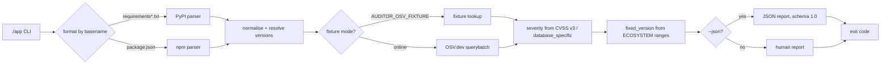

# dependency-auditor

A small, deterministic CLI that reads pinned dependency manifests
(`requirements.txt`, `package.json`), asks [OSV.dev](https://osv.dev) about known
vulnerabilities, and reports each package's findings, a severity derived from
CVSS v3, and the lowest version that fixes them.

[](https://github.com/Gabrielpl-dev/dependency-auditor/actions/workflows/ci.yml)
[](LICENSE)
[](CHANGELOG.md)

Python 3 standard library only — there is nothing to install. It runs offline
against a fixture, which makes it fully testable and CI-friendly.


The recording above is reproducible: the canonical script is
[`docs/demo.tape`](docs/demo.tape) (run it with
[`vhs`](https://github.com/charmbracelet/vhs)) and, in environments without
`vhs`, `python3 docs/render_demo.py` regenerates the same GIF from real CLI
output (that helper needs [Pillow](https://python-pillow.org); the tool itself
does not).

## Quickstart

No dependencies, no install step. Clone and run:

```console
$ git clone https://github.com/Gabrielpl-dev/dependency-auditor.git
$ cd dependency-auditor
$ AUDITOR_OSV_FIXTURE=examples/osv-fixture.json ./app examples
```

Without `AUDITOR_OSV_FIXTURE` the tool queries the live OSV.dev API instead.

## Usage

```
./app [OPTIONS] <PATH>
```

`<PATH>` is exactly one positional argument:

- a **file** whose format is detected by its basename, or
- a **directory**, in which case `requirements.txt` and `package.json` are
  looked up inside it and every match is processed.

### Flags

| Flag | Type | Default | Description |
|---|---|---|---|
| `--json` | boolean | off | Emit the JSON report on stdout (schema `1.0`). |
| `--fail-on <LEVEL>` | enum | `high` | Failure threshold: `low`, `medium`, `high`, `critical`. |
| `--help`, `-h` | boolean | — | Print help on stdout and exit `0`. |
| `--version` | boolean | — | Print `dependency-auditor 0.1.0` on stdout and exit `0`. |
| `--quiet` | boolean | off | Suppress human output; exit codes still apply. Ignored with `--json`. |

Flags may appear before or after the positional argument. Unknown flags exit `2`.

### Exit codes

| Code | Meaning |
|---|---|
| `0` | OK; no vulnerability at or above `--fail-on`. |
| `1` | OK; at least one vulnerability at or above `--fail-on`. |
| `2` | Usage or input error (bad flag, missing path, unknown format, invalid JSON, unreadable file, missing/invalid fixture, no manifests in directory). |
| `3` | Network/upstream error in online mode (non-2xx HTTP, timeout, DNS, unexpected payload). |
| `4` | Unexpected internal error. |

Precedence: `2`, `3` and `4` beat `1`, which beats `0`. In fixture mode code `3`
is unreachable.

### Human report

stdout carries the report only; diagnostics go to stderr. Colours are used only
on a TTY and honour `NO_COLOR`.

```console
$ AUDITOR_OSV_FIXTURE=examples/osv-fixture.json ./app examples/requirements.txt
dependency-auditor 0.1.0
fail-on: high

examples/requirements.txt (PyPI)
  OK    flask 1.0.0
  FAIL  requests 2.19.0
        GHSA-9hjg-9r4m-mvj7  critical (9.8)  fixed in 2.20.0
        CVE-2018-18074: Requests session fixation / credential leak on redirect

Summary: 2 packages (2 audited), 1 vulnerable, 1 vulnerabilities
         critical 1 | high 0 | medium 0 | low 0 | unknown 0
Result: FAIL (exit 1)
```

### JSON report

`--json` writes exactly one JSON document to stdout — no banner, no colour, no
trailing output — so it pipes straight into `jq`.

```console
$ AUDITOR_OSV_FIXTURE=examples/osv-fixture.json ./app --json examples/requirements.txt
```

```json
{
  "schema_version": "1.0",
  "tool": {"name": "dependency-auditor", "version": "0.1.0"},
  "fail_on": "high",
  "inputs": [
    {"path": "examples/requirements.txt", "ecosystem": "PyPI", "packages_total": 2}
  ],
  "packages": [
    {
      "name": "requests",
      "version": "2.19.0",
      "ecosystem": "PyPI",
      "dev": false,
      "audited": true,
      "extras": ["security"],
      "source": {"file": "examples/requirements.txt", "line": 7},
      "max_severity": "critical",
      "vulnerabilities": [
        {
          "id": "GHSA-9hjg-9r4m-mvj7",
          "aliases": ["CVE-2018-18074"],
          "summary": "Requests session fixation / credential leak on redirect",
          "severity": "critical",
          "cvss_score": 9.8,
          "cvss_vector": "CVSS:3.1/AV:N/AC:L/PR:N/UI:N/S:U/C:H/I:H/A:H",
          "fixed_version": "2.20.0"
        }
      ]
    }
  ],
  "warnings": [],
  "summary": {
    "packages_total": 2,
    "packages_audited": 2,
    "packages_vulnerable": 1,
    "vulnerabilities_total": 1,
    "counts": {"critical": 1, "high": 0, "medium": 0, "low": 0, "unknown": 0},
    "exit_code": 1
  }
}
```

`summary.exit_code` always matches the process exit code, and `counts` always
carries all five severity keys, even when zero.

#### Slicing with `jq`

Because stdout is a single clean document, filters compose:

```console
# Every suggested fix, one per line.
$ ./app --json examples | jq -r '.packages[].vulnerabilities[].fixed_version'

# Only the packages that made the run fail.
$ ./app --json examples | jq -r '.packages[] | select(.max_severity != null) | "\(.name) \(.max_severity)"'

# Fail a shell step specifically on critical findings.
$ ./app --json --fail-on critical examples | jq -e '.summary.counts.critical == 0' >/dev/null
```

## Offline / deterministic mode

Set `AUDITOR_OSV_FIXTURE` to a JSON file and the tool never touches the network —
no TCP, no DNS, no HTTP, for any package, including packages absent from the
fixture. This is the mode the test suite runs in.

```console
$ AUDITOR_OSV_FIXTURE=examples/osv-fixture.json ./app examples
```

- An empty value (`AUDITOR_OSV_FIXTURE=""`) is equivalent to unset: online mode.
- A missing, unreadable or invalid fixture exits `2` (an input error, not a
  network error).
- The file is read once, at startup.

### Fixture format

A JSON object keyed by `"<ecosystem>:<name>@<version>"`, where `ecosystem` is
`PyPI` or `npm`, `name` is normalised and `version` is already resolved. Each
value is an array of OSV vulnerability objects (the same schema the OSV.dev
`vulns` field uses):

```json
{
  "PyPI:requests@2.19.0": [
    {
      "id": "GHSA-9hjg-9r4m-mvj7",
      "aliases": ["CVE-2018-18074"],
      "summary": "Requests session fixation / credential leak on redirect",
      "severity": [
        {"type": "CVSS_V3", "score": "CVSS:3.1/AV:N/AC:L/PR:N/UI:N/S:U/C:H/I:H/A:H"}
      ],
      "affected": [
        {
          "package": {"ecosystem": "PyPI", "name": "requests"},
          "ranges": [
            {"type": "ECOSYSTEM", "events": [{"introduced": "0"}, {"fixed": "2.20.0"}]}
          ]
        }
      ]
    }
  ]
}
```

A key that is missing means "no known vulnerabilities" — not an error, and not a
warning. A value that is not an array is a malformed fixture (exit `2`).
Vulnerabilities are reported as they appear in the fixture, and an embedded CVSS
v3 vector is used to derive severity exactly as in online mode.

## Supported inputs

| File | Ecosystem | Notes |
|---|---|---|
| `requirements.txt` (any `requirements*.txt`) | PyPI | `name[extras]==version`; environment markers, line continuations, inline comments and `--hash` are handled. Only an exact `==` literal is audited. |
| `package.json` | npm | `dependencies` and `devDependencies`; `^x.y.z` / `~x.y.z` resolve to the range minimum, anything unresolvable is reported unaudited. |

Anything not pinned exactly — `requests` with no version, `>=2.0`, `==2.*`, npm
`*`/`latest`/`git+…` — is reported with `version: null`, `audited: false` and a
warning, and never contributes to a non-zero exit on its own.

## Non-goals

This is a deliberately small v0.1. It does **not**:

1. Read lockfiles (`package-lock.json`, `yarn.lock`, `pnpm-lock.yaml`, `poetry.lock`, `Pipfile.lock`, `uv.lock`, `pdm.lock`).
2. Support alternative managers (Poetry, Pipenv, PDM, uv, conda, Maven, Gradle, Go modules, Cargo, Composer).
3. Resolve transitive dependencies — only direct declarations are audited.
4. Fix anything: there is no `--fix`, upgrade or patch generation.
5. Produce SBOMs (CycloneDX/SPDX), SARIF, or integrate external scanners.
6. Audit licences, secrets, containers or source code.
7. Handle authentication, private registries or authenticated proxies.
8. Derive severity from CVSS v2 or v4 — only CVSS v3, `database_specific.severity` and `unknown` are supported.
9. Persist, cache, use a database or emit telemetry.
10. Offer a web UI, server, daemon or watch mode.

## Examples

Runnable inputs and an offline fixture live in [`examples/`](examples/) — see
[`examples/README.md`](examples/README.md) for a failing run and a passing run.

```console
$ AUDITOR_OSV_FIXTURE=examples/osv-fixture.json ./app examples
```

## Testing

The whole suite is offline and uses the fixture mode only.

```console
$ make test          # python3 -m unittest discover -s tests -t tests -p 'test_*.py'
$ make coverage      # 80% line-coverage gate on the parsers and severity derivation
$ make lint          # ruff check .
```

`tests/test_acceptance.py` drives `./app` as a black box through `subprocess`
and never imports the project code; it also runs with proxy variables pointed at
a dead port to prove fixture mode performs no network I/O.

### Architecture



## How this was built

This repository is a portfolio piece, and the process behind it matters as much
as the code.

The **specification was written first** — before any code — and is the contract
this implementation is held to: the CLI surface, exit codes, JSON schema and
every edge case were fixed up front.

The **implementation was written by an autonomous AI agent** running inside an
internal agent harness I am developing. No human hand-edited the code: the agent
planned against the spec, wrote `app`, `src/auditor/` and the tests, then fixed
what failed on its own.

The **black-box acceptance tests were written by a different AI agent**,
independent of the implementer, working from the spec alone. They live outside
this repository and are executed by the harness, so the tests committed here are
the public, self-contained ones — not the held-out grading suite. To be clear:
the acceptance tests were *not* written by a person; they were authored by a
separate agent from the one that wrote the implementation, precisely so the
implementation would not be graded by its own assumptions.

A few design decisions worth calling out:

- **Fixture mode as a first-class feature.** `AUDITOR_OSV_FIXTURE` makes the
  tool hermetic. It is not a test backdoor bolted on afterwards; it is part of
  the contract, and the online path shares all of the same parsing, severity and
  reporting code.
- **Stable, meaningful exit codes.** `2` (input), `3` (upstream) and `4`
  (internal) are separated from `1` (findings), so CI can distinguish "this
  dependency is bad" from "the audit could not run".
- **A versioned JSON schema.** `schema_version: "1.0"` is emitted so downstream
  tooling can rely on the exact field set; extra keys are forbidden within a
  schema version, and any change lands as a new version.

## License

[MIT](LICENSE) © 2026 Gabrielpl-dev
